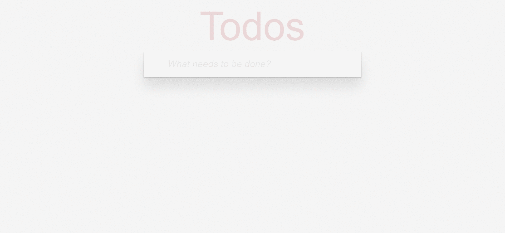

# TodoApp

This project was generated with [angular-cli](https://github.com/angular/angular-cli) version 1.0.0-beta.26.

Live demo : http://ahmadarif.github.io/todo-angular2

## Development server
Run `ng serve` for a dev server. Navigate to `http://localhost:4200/`. The app will automatically reload if you change any of the source files.

## Build

Run `ng build` to build the project. The build artifacts will be stored in the `dist/` directory. Use the `--prod` flag for a production build.

## Technology Usage
  - TodoMVC (similar application) : http://todomvc.com
  - Todo CSS : https://github.com/tastejs/todomvc-app-css
  - Growl : https://github.com/akserg/ng2-toasty
